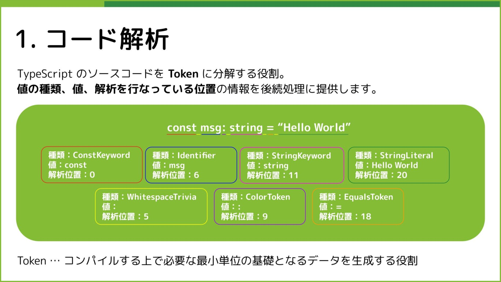
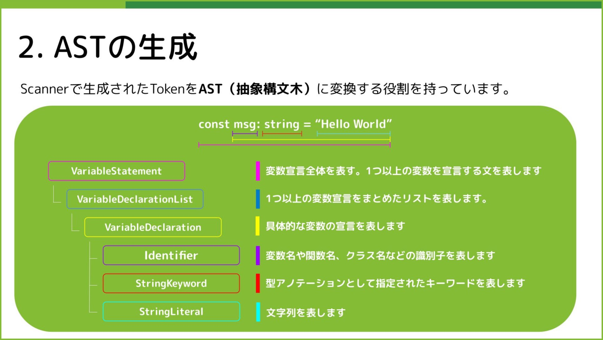
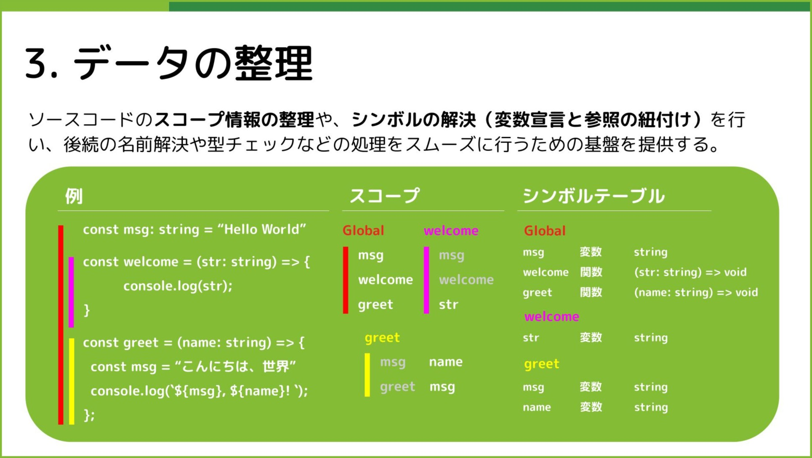
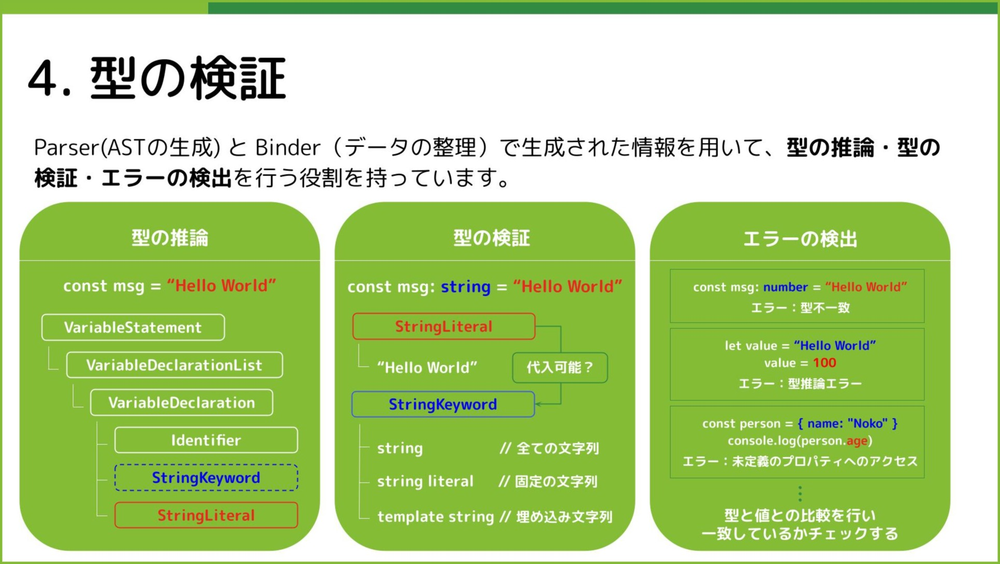
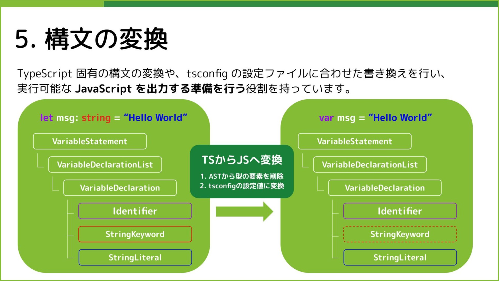
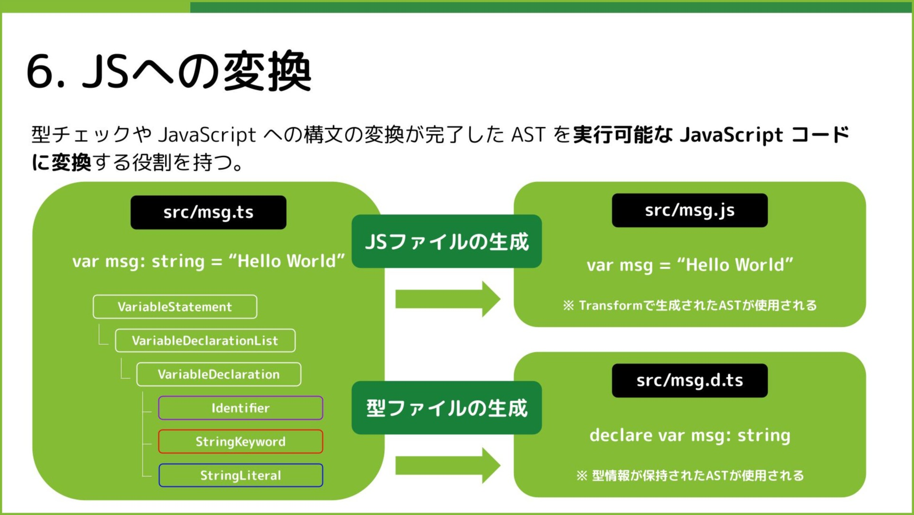

# 🫡 大事

このリポジトリのコードは、以下 mini-typescript のコードを参照しております。

https://github.com/sandersn/mini-typescript

# 📚 コード内の用語

**🏷️ 文（Statement）**

プログラムの実行単位（アクションや宣言）であり、単独で意味を持つコードになります。

一般的には値を返さず、「命令」のような役割を持つコードになります。

| 文の種類   | 例                    | 説明               |
| ---------- | --------------------- | ------------------ |
| 変数宣言文 | let x = 10;           | 変数の宣言と代入   |
| 制御文     | if (x > 0) { ... }    | 条件分岐           |
| ループ文   | while (x > 0) { ... } | 繰り返し処理       |
| return 文  | return x;             | 関数から値を返す   |
| ブロック文 | { let y = 5; }        | 複数の文をまとめる |

**🏷️ 式（Expression）**

プログラム内の演算や参照であり、単独ではプログラムの流れを制御しないコードになります。

値を生成するコードの単位であり、評価すると（文と反対に）値が返るものです。

| 式の種類          | 例                              | 説明                      |
| ----------------- | ------------------------------- | ------------------------- |
| リテラル式        | "Hello" / 28                    | 値そのもの                |
| 変数              | x / y + 10                      | 変数の参照や計算          |
| 関数呼び出し      | add(2, 3)                       | 関数を実行して値を得る    |
| 配列/オブジェクト | [1, 2, 3] / { name: "Maria" }   | データ構造を作る          |
| 代入式            | x = 5                           | 代入の結果として 5 を返す |
| 三項演算子        | x > 0 ? "Positive" : "Negative" | 条件に応じて値を返す      |

**🏷️ 式文**

「式を文として扱う」特別なケースに用いられます。

式は本来値を返すが、文として評価される場合に値は破棄されるため、結果的に値を返さない式となる。

```ts
x + 10; // ✅ 式文 (計算するが値を使わない)
add(2, 3); // ✅ 関数呼び出し (戻り値を使わない)
```

**🛑Symbol（シンボル）**

コンパイラの型解析で使われる識別子（名前）に対応する情報を管理するオブジェクト。

具体的には、変数、関数、クラス、型エイリアスなどの宣言情報を保持する役割を持っています。
主に Binder フェーズで作成され、Table 型はシンボルを管理するためのマップの役割を持っています。

```ts
var x = 10;
type Point = { x: number; y: number };
function foo() {}
```

| 名前    | 種類         | 宣言の位置                              |
| ------- | ------------ | --------------------------------------- |
| `x`     | 変数         | `var x = 10`                            |
| `Point` | 型エイリアス | `type Point = { x: number, y: number }` |
| `foo`   | 関数         | `function foo() {}`                     |

**📋 関数シグネチャ**

関数の型情報を表す定義のことを指しており、以下のような構成要素をを持っています。

1. 関数名 (省略される場合もある)
2. 引数の型情報
3. 戻り値の型情報
4. 型パラメータ (ジェネリック型などの場合)

```ts
function add(x: number, y: number): number {
  return x + y;
}
```

この例では、`add` 関数のシグネチャは `(x: number, y: number) => number` となります。

# 🛤️ 全体像

## ✅Scanner



## ✅Parser



## ✅Binder



## ✅Checker



## ✅Transform



## ✅Emitter



## 注意

1. ChatGPT に説明してもらっている箇所なども含まれており、文章に統一感がないかもしれません
2. このリポジトリのコードは全て [mini-typescript](https://github.com/sandersn/mini-typescript) のリポジトリのコードを参照しています。ライセンス周りの不備などを見つけた方は、ご連絡をいただけますと幸いです。
